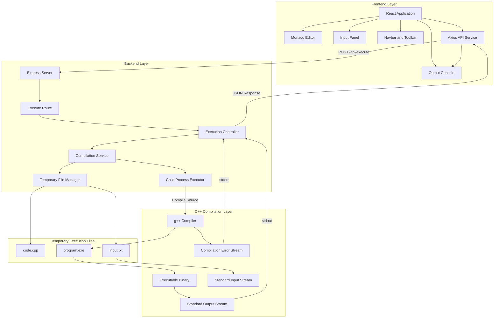

# CPP Studio

CPP Studio is a modern web-based C++ development environment built using React, Monaco Editor, Node.js, and Express. The application provides a lightweight IDE experience directly in the browser with real-time C++ compilation and execution support.

The project is designed with a professional IDE-inspired architecture and focuses on delivering a clean developer experience, modular code structure, and scalable backend execution pipeline.

---

# Features

## Frontend

- Monaco Editor integration
- VS Code-inspired UI
- Syntax highlighting for C++
- Real-time code editing
- Input and output panels
- Professional dark theme
- Responsive layout
- Loading states during compilation
- Keyboard shortcut support
- Editor tab system

## Backend

- REST API architecture
- Real C++ compilation using g++
- Runtime execution support
- Standard input handling
- Compilation error handling
- Runtime error handling
- Temporary file generation
- Modular service architecture

---

# Preview


---

# Tech Stack

## Frontend

| Technology | Purpose |
|---|---|
| React | User Interface |
| Vite | Frontend Build Tool |
| Monaco Editor | Code Editor |
| Axios | API Communication |
| CSS3 | Styling |

## Backend

| Technology | Purpose |
|---|---|
| Node.js | Runtime Environment |
| Express.js | API Server |
| Child Process | C++ Compilation |
| g++ Compiler | C++ Execution |

---

# System Architecture


---

# Project Structure

```text
cpp-studio/
│
├── client/
│   ├── src/
│   │   ├── components/
│   │   │   ├── Editor/
│   │   │   ├── InputPanel/
│   │   │   ├── OutputPanel/
│   │   │   └── Navbar/
│   │   │
│   │   ├── pages/
│   │   ├── services/
│   │   ├── styles/
│   │   ├── App.jsx
│   │   └── main.jsx
│   │
│   ├── index.html
│   ├── package.json
│   └── vite.config.js
│
├── server/
│   ├── controllers/
│   ├── routes/
│   ├── services/
│   ├── temp/
│   ├── utils/
│   ├── server.js
│   └── package.json
│
├── docker/
│
├── README.md
└── package.json
```

---

# Installation

## Clone Repository

```bash
git clone <repository-url>
cd cpp-studio
```

---

# Frontend Setup

```bash
cd client
npm install
npm run dev
```

Frontend runs on:

```text
http://localhost:5173
```

---

# Backend Setup

```bash
cd server
npm install
npm run dev
```

Backend runs on:

```text
http://localhost:5000
```

---

# C++ Compiler Setup

The project requires a working g++ compiler installed on the system.

## Windows

Install MSYS2:

https://www.msys2.org/

Install GCC:

```bash
pacman -S mingw-w64-ucrt-x86_64-gcc
```

Add to PATH:

```text
C:\msys64\ucrt64\bin
```

Verify installation:

```bash
g++ --version
```

---

# API Endpoint

## Execute C++ Code

### Endpoint

```http
POST /api/execute
```

### Request Body

```json
{
  "code": "#include<iostream>...",
  "input": "5 10"
}
```

### Response

```json
{
  "success": true,
  "output": "15"
}
```

---

# Execution Flow

```text
1. User writes C++ code in Monaco Editor
2. Frontend sends code and input to backend API
3. Express server receives request
4. Backend generates temporary files
5. g++ compiles the C++ source
6. Executable runs with provided input
7. stdout/stderr captured
8. Output returned to frontend
9. Output displayed in terminal panel
```

---

# Security Considerations

Current implementation is intended for local development and educational purposes.

The current execution model directly runs user-generated code on the host machine.

For production deployment, the following improvements are recommended:

- Docker sandboxing
- Execution timeout limits
- CPU and memory restrictions
- Container isolation
- Rate limiting
- Temporary file cleanup
- User authentication
- Secure process execution

---

# Future Improvements

## IDE Features

- Multi-file support
- File explorer
- Editor tabs
- Themes
- Auto-save
- Keyboard shortcuts
- IntelliSense
- Syntax diagnostics
- Terminal emulator

## Compiler Features

- Multiple language support
- Dockerized execution
- Execution metrics
- Memory usage tracking
- Runtime benchmarking
- Competitive programming mode

## Cloud Features

- User authentication
- Saved projects
- Cloud workspace
- GitHub integration
- Real-time collaboration

---

# Performance Notes

The project currently uses direct local execution through child processes.

Compilation and execution performance depend on:

- System hardware
- Installed compiler
- Input size
- Program complexity

---

# Development Philosophy

CPP Studio is designed around the following principles:

- Clean architecture
- Modular components
- Professional developer experience
- Minimal but powerful UI
- Real execution environment
- Scalable backend structure

---

# License

This project is licensed under the MIT License.

---

# Author

Akash Santra
